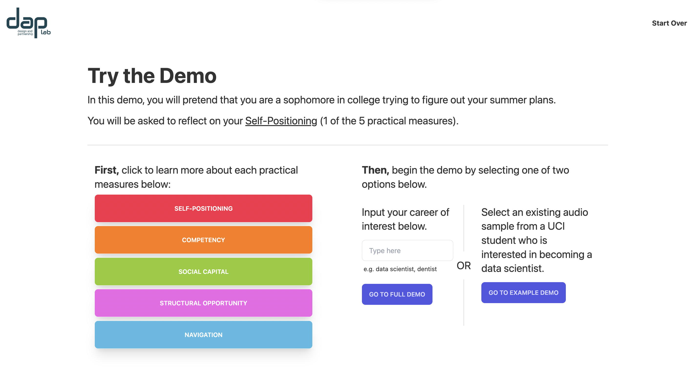
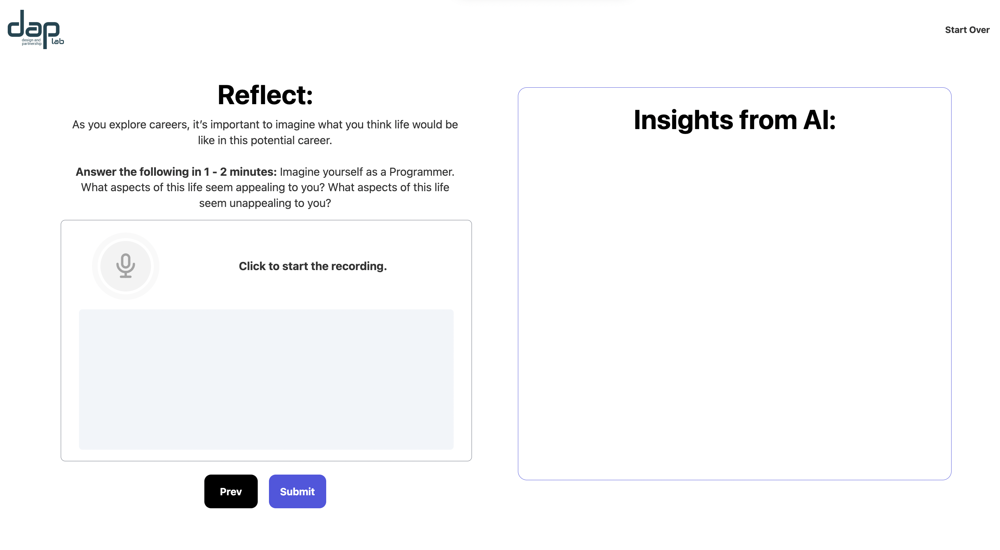
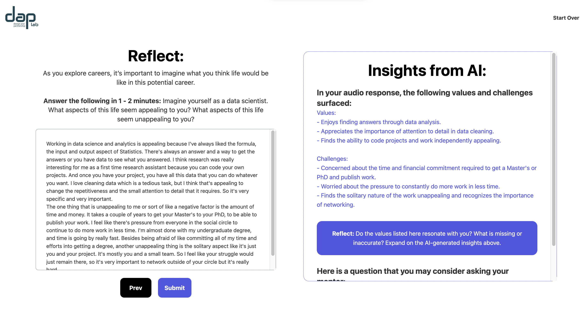

# Tangram


## Introduction:

Tangram is an AI-augmented space for reflection for undergraduates exploring their careers. The web application takes in students’ speech responses regarding their career interests and uses ChatGPT to formulate them into summaries and questions that help deepen students’ conversations with their mentors. Tangram provides a summary from students’ responses, including their Values and Challenges, and offers a question that they can ask their mentors. This application is available [here](https://tangramproject.vercel.app/). You can also clone this repository and try it on your own!

## What to install:

Input your own OpenAI key in .env (`NEXT_PUBLIC_OPENAI_API_KEY`)

```
npm install --legacy-peer-deps
```

Use `npm run dev` to launch.

Open http://localhost:3000 to view it in your own browser

## Demo:

The left side columns can be opened to see the measured details. On the right side, you can select Full Demo or use the example demo. You’ll be asked to input a career of interest to access the full demo.



For the Full demo.
You can use the voice recording to record the transcript and edit your transcript in the textbox provided.



For the Example demo.
Submit the existing transcript to see the generated response from ChatGPT.



## How this was made:

This was made as a next.js app with integration of the ChatGPT API. We used Tailwind and DaisyUI to style the app. We also used lottie animations and framer motion.

Thanks to Samhir Tarif for the react voice recorder hook [react-audio-voice-recorder](https://github.com/samhirtarif/react-audio-recorder). Thanks to Sarghm for the [voice record animation tutorial](https://codesandbox.io/s/agitated-shockley-cdzuy?from-embed=&file=/src/App.tsx). Thanks to vydimitrov for the [react countdown circle timer](https://www.npmjs.com/package/react-countdown-circle-timer).

## Credits:

This is made in the [Design and Partnership Lab](https://www.daplab.education.uci.edu/) in the School of Education at University of California, Irvine.

Created by: Sharon Ma and David Ning

Supervised by Dr. June Ahn and Jenny Han, in collaboration with the Gates Identity team: Dr. Ha Nguyen, Seth Van Doren, Christopher Martinez, Jessica Cai.

For more information about the research behind Tangram, go to: https://sites.uci.edu/axcis/
